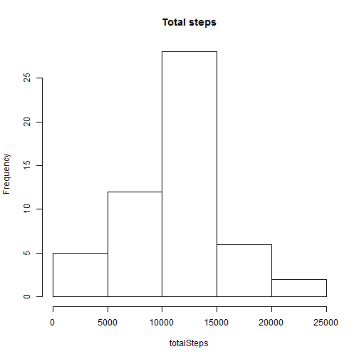
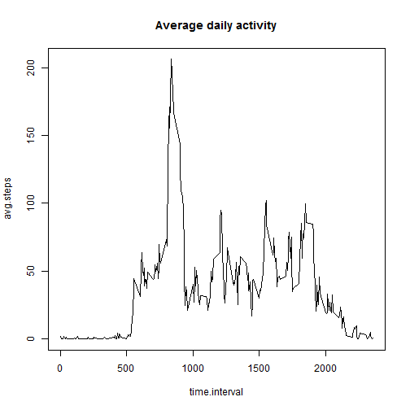
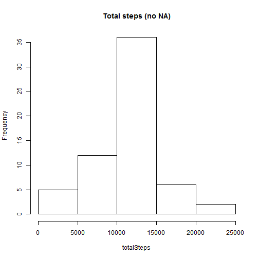

# Reproducible Research: Peer Assessment 1


## Loading and preprocessing the data

```r
#unzip("activity.zip")
data<-read.csv("activity.csv",comment.char="",colClasses = c('integer','Date','integer'))
```


## What is mean total number of steps taken per day?

1. Build histogram for total steps

```r
totalSteps<-tapply(data$steps,data$date,sum)
histTotalSteps<-hist(totalSteps, main="Total steps")
```

 


2. Calculate the mean and the median

```r
mean(totalSteps,na.rm=TRUE)
```

```
## [1] 10766
```

```r
median(totalSteps,na.rm=TRUE)
```

```
## [1] 10765
```

## What is the average daily activity pattern?

1. Building time series plot of 5-minute interval and the average number of steps taken

```r
time.interval<-subset(data$interval,data$date==as.Date("2012-10-01",format="%Y-%m-%d"))
avg.steps<-tapply(data$steps,data$interval,mean,na.rm=TRUE)
plot(time.interval,avg.steps,type="l",main="Average daily activity")
```

 


2. Identifying the number of 5-minute time interval, where the average maximum number of steps

```r
time.interval[which.max(avg.steps)]
```

```
## [1] 835
```

## Imputing missing values
1. Calculate total number of rows with missing values

```r
good<-complete.cases(data)
na.length<-length(good[good==FALSE])
print(na.length)
```

```
## [1] 2304
```
2. Strategy for filling in missing values in the dataset


As soon as represented dates are in one-season interval (from 2012-10-01 to 2012-11-30), we assume, that there is no significant change in activity pattern during that time interval. That is why we will use average daily activity (number of steps) per 5 minute interval for imputing:


```r
data.no.na<-data
for (i in 1:dim(data.no.na)[1]){
  if (is.na(data.no.na[i,"steps"])){
    data.no.na[i,"steps"]<-avg.steps[names(avg.steps)==data.no.na[i,"interval"]]
  }
}
```


3. Making histogram of the total number of steps taken.

```r
totalSteps.no.na<-tapply(data.no.na$steps,data.no.na$date,sum)
histTotalSteps.no.na<-hist(totalSteps.no.na, main="Total steps (no NA)", xlab="totalSteps")
```

 


4. Calculate new mean and the median:

```r
m2<-mean(totalSteps.no.na)
med2<-median(totalSteps.no.na)
```


Was:

```r
m1<-mean(totalSteps, na.rm=TRUE)
med1<-median(totalSteps,na.rm=TRUE)
```


Let's represent it as table:

```r
matr<-matrix(c(m1,m2,med1,med2),nrow=2,ncol=2)
colnames(matr)<-c("Mean","Median")
rownames(matr)<-c("Initial","Imputed")
matr
```

```
##          Mean Median
## Initial 10766  10765
## Imputed 10766  10766
```

As we see, there is no significant difference.

## Are there differences in activity patterns between weekdays and weekends?
